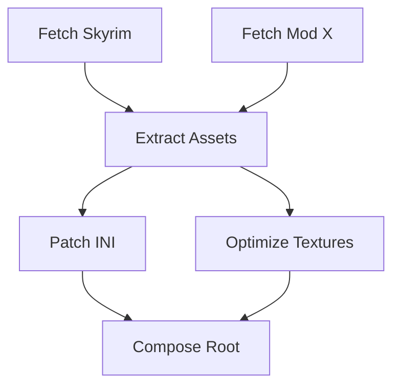

# Arquitetura do Executor Concorrente (State Machine v2)

A v2 do design do Compositor substitui o loop sequencial da v1 por um modelo de execução baseado em **Grafo de Dependências (DAG)**, permitindo paralelismo controlado.

## 1. O Conceito: De Lista para DAG

Embora o input seja um JSON com uma lista de `steps`, as dependências expressas (ex: `use_step`) formam implicitamente um DAG.

-   **Nós:** Cada `step` do JSON é um nó.
-   **Arestas:** Uma dependência (`use_step: "A"`) cria uma aresta direcionada de `A` para o passo atual.

## 2. Componentes da Nova Arquitetura

### 2.1. O Estado Thread-Safe (`SafeState`)

Como múltiplos passos serão executados simultaneamente, o acesso ao mapa de resultados deve ser sincronizado.

```go
type SafeState struct {
    mu results.RWMutex
    data map[string]Result
}

func (s *SafeState) Get(id string) (Result, bool) {
    s.mu.RLock()
    defer s.mu.RUnlock()
    // ...
}

func (s *SafeState) Set(id string, res Result) {
    s.mu.Lock()
    defer s.mu.Unlock()
    // ...
}
```

### 2.2. O Agendador (Scheduler) e Filas Distintas

Para atender ao requisito de **Downloads Sequenciais** mas **Builds Paralelos**, o Scheduler precisa gerenciar duas filas lógicas:

1.  **Network Queue (Serial):** Para steps de Fetch. Capacidade = 1.
2.  **Compute Queue (Parallel):** Para steps de Build. Capacidade = N (configurável).

#### Algoritmo de Execução Simplificado:

1.  **Análise Preliminar:**
    -   Construir o DAG e calcular `in-degree`.

2.  **Dispatch Loop:**
    -   Identificar nós prontos (`in-degree == 0`).
    -   Se o nó é `NetworkType`:
        -   Enviar para a **Network Queue**. Se já houver um download ativo, aguardar.
    -   Se o nó é `ComputeType`:
        -   Enviar para a **Compute Queue**.
    -   Workers de cada fila processam os itens e notificam o Scheduler na conclusão.
    -   Scheduler desbloqueia dependentes.

4.  **Processamento:**
    -   Worker executa o step.
    -   **Sucesso:**
        -   Grava resultado no `SafeState`.
        -   Notifica o Scheduler de que o step terminou.
        -   Scheduler decrementa o `in-degree` dos nós dependentes.
        -   Novos nós com `in-degree == 0` são enviados para a `queue`.
    -   **Falha:**
        -   Sinaliza cancelamento global (Context cancel). Todos os workers param.

## 3. Isolamento de Recursos no State Machine

Para garantir a **Hermeticidade** (Fase Fetch vs Build), a máquina de estados deve ter consciência do contexto de execução.

-   **Validação de Fase:** Antes de despachar um step para um worker, o Scheduler verifica:
    -   Se o step é `op: fetch_*` -> Requer contexto `NetworkAllowed`.
    -   Se o step é `op: run_tool` -> Requer contexto `NetworkDenied`.

-   **Sandboxing Automático:** Ao executar um step `NetworkDenied`, o worker deve automaticamente configurar os namespaces (via `unshare` ou similar) antes de invocar o processo externo.

## 4. Tratamento de Erros e Cancelamento

O uso de `context.Context` do Go é fundamental aqui.
-   Se um download falha na thread 3, a função principal deve cancelar o Context.
-   Todos os outros workers devem escutar `ctx.Done()` e abortar suas operações (limpando arquivos temporários) graciosamente.

## 5. Exemplo de Fluxo (Visual)



1.  Scheduler vê que `A` e `B` têm in-degree 0.
2.  Despacha `A` e `B` para workers (paralelo).
3.  `A` termina. `C` ainda espera `B`.
4.  `B` termina. `C` agora tem in-degree 0.
5.  Despacha `C`.
6.  `C` termina. `D` e `E` liberados (paralelo).
```
